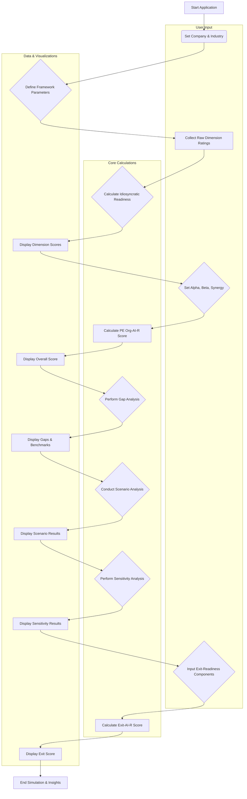

id: 69418ce8893d17251642968b_documentation
summary: PE-AI readiness simulator Documentation
feedback link: https://docs.google.com/forms/d/e/1FAIpQLSfWkOK-in_bMMoHSZfcIvAeO58PAH9wrDqcxnJABHaxiDqhSA/viewform?usp=sf_link
environments: Web
status: Published
# QuLab: PE-AI Readiness Simulator - A Comprehensive Developer Guide

## Introduction to the PE-AI Readiness Simulator
Duration: 0:05:00

Welcome to the **PE-AI Readiness Simulator** codelab! This application, named `QuLab`, is a powerful Streamlit tool designed for Private Equity (PE) quantitative analysts to assess the AI readiness of target companies. In today's competitive landscape, understanding a company's potential for AI-driven value creation is paramount for strategic investment decisions.

This codelab will provide you with a comprehensive guide to understanding, running, and extending the `QuLab` application. You'll learn about its core functionalities, the underlying mathematical models, and how it leverages Streamlit for an interactive user experience.

### Importance and Concepts Explained
The `QuLab` simulator addresses a critical need in private equity: quantifying an acquisition target's AI maturity and potential. It allows analysts to move beyond subjective assessments and apply a structured, data-driven approach to AI due diligence. Key concepts explored in this application include:

*   **Idiosyncratic Readiness:** A company's internal AI capabilities across various dimensions like Data Infrastructure, AI Governance, Talent, Leadership, etc.
*   **Systematic Opportunity:** The inherent AI market potential within a company's specific industry sector.
*   **PE Org-AI-R Score:** A proprietary composite score that blends internal capabilities, external market opportunity, and synergistic potential to provide an overall AI readiness metric for PE firms.
*   **Gap Analysis:** Identifying specific areas where a target company lags behind industry benchmarks, highlighting critical investment opportunities.
*   **Scenario Analysis:** Modeling how targeted investments or market changes could impact a company's AI readiness score.
*   **Sensitivity Analysis:** Pinpointing the "swing factors" – dimensions whose improvement would yield the highest impact on the overall AI readiness score.
*   **Exit-AI-R Score:** A metric assessing how attractive a company's AI capabilities would be to a future buyer, crucial for long-term exit planning.

### Application Flow and Architecture
The Streamlit application follows a logical flow, guiding the user through a structured assessment process. Below is a high-level flowchart illustrating the application's main components and their interactions:



<aside class="positive">
<b>Why this is important:</b> Understanding the application's overall flow and the interplay between different sections will help you debug, extend, and customize the simulator more effectively. The modular design, using helper functions and Streamlit's session state, promotes maintainability.
</aside>

## Step 1: Setting up and Understanding the Code Structure
Duration: 0:08:00

Before diving into the specifics of the application's logic, let's ensure you can run the application and grasp its overall structure.

### 1.1 Running the Streamlit Application

1.  **Save the Code:** Save the provided Python script as `app.py` (or any other `.py` file).
2.  **Install Dependencies:** Make sure you have Streamlit, pandas, numpy, matplotlib, and seaborn installed. If not, open your terminal or command prompt and run:
    ```console
    pip install streamlit pandas numpy matplotlib seaborn
    ```
3.  **Run the App:** Navigate to the directory where you saved `app.py` in your terminal and execute:
    ```console
    streamlit run app.py
    ```
    This will open the application in your default web browser.

### 1.2 Code Structure Overview

The application is structured into several logical blocks:

*   **Imports and Page Configuration:** Standard library and third-party imports, followed by `st.set_page_config` to customize the browser tab and layout.
*   **Constants & Static Data:** Dictionaries defining systematic opportunity scores, dimension weights (default and sector-specific), industry benchmarks, and exit weights. These are fixed parameters for the models.
*   **Session State Initialization:** Crucial for Streamlit, `st.session_state` is initialized with default values for all interactive components and calculated results. This ensures persistent data across user interactions.
*   **Helper Functions:** A collection of pure Python functions (`get_dimension_weights`, `calculate_idiosyncratic_readiness`, `calculate_pe_org_ai_r`, etc.) that encapsulate the core business logic and calculations. These functions generally do not directly interact with Streamlit widgets or `st.session_state`.
*   **Streamlit Application Flow:** The main part of the script that defines the user interface using Streamlit widgets (`st.header`, `st.markdown`, `st.text_input`, `st.selectbox`, `st.slider`, `st.metric`, `st.dataframe`, `st.pyplot`, `st.expander`, `st.info`). Each section corresponds to a step in the AI readiness assessment.

```python
import streamlit as st
import pandas as pd
import numpy as np
import matplotlib.pyplot as plt
import seaborn as sns

st.set_page_config(page_title="QuLab: PE-AI readiness simulator", layout="wide")
st.sidebar.image("https://www.quantuniversity.com/assets/img/logo5.jpg")
st.sidebar.divider()
st.title(f"QuLab: PE-AI readiness simulator - {st.session_state.get('company_name', 'InnovateCo')}")
st.divider()

#  Introduction Markdown 
st.markdown(...)

#  Constants & Static Data 
SYSTEMATIC_OPPORTUNITY_SCORES = {...}
DEFAULT_DIMENSION_WEIGHTS = {...}
# ... and so on for other constants

#  Initialize Session State 
session_state_defaults = {...}
for key, default_value in session_state_defaults.items():
    if key not in st.session_state:
        st.session_state[key] = default_value

#  Helper Functions 
def get_dimension_weights(industry: str) -> dict:
    ...
def calculate_idiosyncratic_readiness(...) -> tuple[float, pd.DataFrame, dict]:
    ...
# ... and so on for other helper functions

#  Streamlit Application Flow 
# 1. Welcome & Company Selection
st.header("1. Welcome & Company Selection")
# ... Streamlit widgets and logic ...

# 2. Define Static Framework Parameters
st.header("2. Define Static Framework Parameters")
# ... Streamlit widgets and logic ...

# ... continues for all 9 sections ...
```

<aside class="positive">
<b>Tip:</b> Using `st.session_state` is fundamental for Streamlit applications. It allows widgets to retain their values across reruns and provides a centralized place to store application data. Notice how all interactive widgets (`st.text_input`, `st.selectbox`, `st.slider`) use the `key` parameter to directly link to a `st.session_state` variable.
</aside>

## Step 2: Welcome and Company Selection
Duration: 0:03:00

The first interactive section of the application focuses on gathering basic information about the target company. This initial data is crucial as it influences sector-specific parameters throughout the simulation.

### 2.1 UI Elements and Session State
This section uses `st.text_input` for the company name and `st.selectbox` for the industry sector. Both widgets are linked directly to `st.session_state` variables using the `key` parameter. This means any change in these widgets immediately updates `st.session_state.company_name` and `st.session_state.company_industry`, triggering a Streamlit rerun and updating dependent calculations and displays.

```python
# 1. Welcome & Company Selection
st.header("1. Welcome & Company Selection")
st.markdown("""
Alex, let's start by defining the target company and its industry sector. These inputs will dynamically
adjust our analytical framework, including industry-specific benchmarks and dimension weights.
""")

col1, col2 = st.columns(2)
with col1:
    st.text_input(
        "Target Company Name",
        value=st.session_state.company_name,
        key="company_name"
    )
with col2:
    st.selectbox(
        "Company Industry Sector",
        options=list(SYSTEMATIC_OPPORTUNITY_SCORES.keys()),
        index=list(SYSTEMATIC_OPPORTUNITY_SCORES.keys()).index(st.session_state.company_industry),
        key="company_industry"
    )
st.divider()
```

### 2.2 Impact on Application Logic
Choosing an industry sector dynamically alters the `AI Readiness Dimension Weights` and `Industry Benchmarks` used in later steps. This demonstrates how initial user inputs can drive significant changes in the analytical framework. The `SYSTEMATIC_OPPORTUNITY_SCORES` dictionary is used to populate the `st.selectbox` options, ensuring consistency with the predefined sectors.

## Step 3: Defining Static Framework Parameters
Duration: 0:04:00

This section presents the foundational data that underpins the AI readiness analysis. It's crucial for transparency and for understanding the context-specific nature of the assessment.

### 3.1 Constants and Their Role
The application defines several global constants (dictionaries) that hold static data:

*   `SYSTEMATIC_OPPORTUNITY_SCORES`: Scores reflecting the general AI opportunity in different industries.
*   `DEFAULT_DIMENSION_WEIGHTS`: A fallback for dimension weights if a specific industry isn't defined.
*   `SECTOR_DIMENSION_WEIGHTS`: Industry-specific weights for each AI readiness dimension. This is a critical feature, acknowledging that the importance of e.g., 'AI Governance' might differ between 'Healthcare' and 'Manufacturing'.
*   `INDUSTRY_BENCHMARKS`: Expected scores for each AI dimension, serving as a comparison point for the target company.
*   `EXIT_WEIGHTS`: Weights for calculating the `Exit-AI-R Score`.

### 3.2 Dynamic Display with `st.expander`
The framework parameters are displayed within an `st.expander`. This keeps the UI clean by allowing users to toggle the visibility of detailed information. The `get_dimension_weights` helper function is used here to retrieve the correct, industry-specific weights.

```python
# 2. Define Static Framework Parameters
st.header("2. Define Static Framework Parameters")
st.markdown(f"""
Before diving into `InnovateCo`'s specifics, let's review the foundational data that underpins our analysis.
This includes the `Systematic Opportunity Score` for the **{st.session_state.company_industry}** sector,
the `AI Readiness Dimension Weights` (adjusted for **{st.session_state.company_industry}**),
and `Industry Benchmarks` against which we will compare {st.session_state.company_name}.
""")

with st.expander("View Framework Parameters"):
    st.markdown("##### Systematic Opportunity Scores by Industry")
    st.dataframe(pd.DataFrame(list(SYSTEMATIC_OPPORTUNITY_SCORES.items()), columns=['Industry', 'Score']), width='stretch')
    
    st.markdown(f"##### AI Readiness Dimension Weights for {st.session_state.company_industry}")
    current_weights_df = pd.DataFrame(list(get_dimension_weights(st.session_state.company_industry).items()), columns=['Dimension', 'Weight'])
    st.dataframe(current_weights_df, width='stretch')

    st.markdown(f"##### Industry Benchmarks for {st.session_state.company_industry}")
    benchmark_df = pd.DataFrame(list(INDUSTRY_BENCHMARKS.get(st.session_state.company_industry, {}).items()), columns=['Dimension', 'Benchmark Score (0-100)'])
    st.dataframe(benchmark_df, width='stretch')
st.divider()
```

<aside class="positive">
<b>Best Practice:</b> Centralizing constants makes the application easier to configure and update. Using `st.expander` is a great way to manage UI complexity and optional information.
</aside>

## Step 4: Collecting Raw Idiosyncratic Readiness Ratings
Duration: 0:05:00

This step is where the analyst's qualitative assessment of the target company's AI capabilities is quantified. The seven critical AI readiness dimensions are presented, and the user provides a raw rating for each.

### 4.1 AI Readiness Dimensions
The application assesses AI readiness across these seven dimensions:

1.  **Data Infrastructure:** Availability, quality, and accessibility of data.
2.  **AI Governance:** Policies, ethical guidelines, and compliance for AI initiatives.
3.  **Technology Stack:** Tools, platforms, and models used for AI development and deployment.
4.  **Talent:** Availability of skilled AI professionals (data scientists, engineers).
5.  **Leadership:** Strategic vision and commitment from top management for AI.
6.  **Use Case Portfolio:** Current and potential applications of AI within the company.
7.  **Culture:** Organizational receptiveness to AI adoption and innovation.

### 4.2 User Input with Sliders
`st.slider` widgets are used to collect raw ratings on a scale of 1 to 5. Each slider is directly linked to a specific `st.session_state` variable using a unique `key`. After all sliders are rendered, their values are consolidated into a dictionary `st.session_state.raw_dimension_ratings`.

```python
# 3. Collect Raw Idiosyncratic Readiness Ratings
st.header("3. Collect Raw Idiosyncratic Readiness Ratings")
st.markdown(f"""
Now, Alex, it's time to translate your due diligence findings for **{st.session_state.company_name}** into
quantifiable scores. Use the sliders below to rate {st.session_state.company_name}'s current capabilities
across seven critical AI readiness dimensions on a scale of 1 to 5.
""")

dimension_ratings_keys = {
    'Data Infrastructure': "raw_rating_data_infra",
    'AI Governance': "raw_rating_ai_governance",
    'Technology Stack': "raw_rating_tech_stack",
    'Talent': "raw_rating_talent",
    'Leadership': "raw_rating_leadership",
    'Use Case Portfolio': "raw_rating_use_case_portfolio",
    'Culture': "raw_rating_culture"
}

cols = st.columns(2)
for i, (dim, key) in enumerate(dimension_ratings_keys.items()):
    with cols[i % 2]:
        st.slider(
            f"{dim} Rating (1-5)",
            min_value=1,
            max_value=5,
            step=1,
            value=st.session_state[key],
            key=key
        )

# Populate raw_dimension_ratings from session state after all sliders have been rendered
raw_ratings_from_session = {dim: st.session_state[key] for dim, key in dimension_ratings_keys.items()}
st.session_state.raw_dimension_ratings = raw_ratings_from_session
st.divider()
```

## Step 5: Calculating Normalized Idiosyncratic Readiness
Duration: 0:07:00

The raw ratings from the previous step are now transformed into a quantitative `Idiosyncratic Readiness Score`. This is a crucial internal metric reflecting the company's inherent AI capabilities, adjusted for industry-specific priorities.

### 5.1 The Idiosyncratic Readiness Formula
The `Idiosyncratic Readiness Score` is calculated as a weighted sum of the normalized raw ratings for each dimension. The raw ratings (1-5) are first scaled to a 0-100 range.

$$ IdiosyncraticReadiness = \sum_{i=1}^{7} w_i \cdot \left( \frac{\text{Raw Rating}_i}{5} \times 100 \right) $$

where:
*   $w_i$ is the industry-specific weight for dimension $i$.
*   $\text{Raw Rating}_i$ is the analyst's assessment (1-5) for dimension $i$.
*   The raw rating is normalized to a 0-100 scale before weighting.

### 5.2 `calculate_idiosyncratic_readiness` Function
This helper function takes the raw ratings and the industry as input. It retrieves the appropriate weights, normalizes the ratings, and computes the weighted sum. It also returns a `pandas.DataFrame` containing detailed scores for each dimension.

```python
def calculate_idiosyncratic_readiness(raw_ratings: dict, industry: str) -> tuple[float, pd.DataFrame, dict]:
    """Calculates Idiosyncratic Readiness score and dimension scores."""
    weights = get_dimension_weights(industry)
    
    # Normalize raw ratings (1-5 scale) to (0-100 scale)
    normalized_ratings = {k: (v / 5) * 100 for k, v in raw_ratings.items()}
    
    # Calculate weighted sum
    weighted_sum = sum(normalized_ratings[dim] * weights.get(dim, 0) for dim in raw_ratings.keys())
    
    overall_score = weighted_sum

    dimension_data = []
    for dim, weight in weights.items():
        dimension_data.append({
            'Dimension': dim,
            'Raw Rating (1-5)': raw_ratings.get(dim, 0),
            'Normalized Score (0-100)': normalized_ratings.get(dim, 0),
            'Weight': weight
        })
    df = pd.DataFrame(dimension_data)
    
    return overall_score, df, weights
```

### 5.3 Displaying Results and Visualization
The calculated `Idiosyncratic Readiness Score` is displayed using `st.metric`. A detailed breakdown of scores per dimension is presented in a `st.dataframe`, and a bar chart generated using `matplotlib` and `seaborn` provides a clear visual summary.

```python
# 4. Calculate Normalized Idiosyncratic Readiness
st.header("4. Calculate Normalized Idiosyncratic Readiness")
st.markdown(f"""
Based on your raw ratings, we now calculate **{st.session_state.company_name}**'s `Idiosyncratic Readiness Score`.
This score reflects the company's internal AI capabilities, weighted by the importance of each dimension
for the **{st.session_state.company_industry}** sector.
""")

st.markdown(r"""
$$ IdiosyncraticReadiness = \sum_{i=1}^{7} w_i \cdot \left( \frac{\text{Raw Rating}_i}{5} \times 100 \right) $$
""")
st.markdown(rf"""
where:
*   $w_i$ is the industry-specific weight for dimension $i$.
*   $\text{{Raw Rating}}_i$ is your assessment (1-5) for dimension $i$.
*   The raw rating is normalized to a 0-100 scale before weighting.
""")

idiosyncratic_readiness, innovateco_dimension_scores_df, current_weights = calculate_idiosyncratic_readiness(
    st.session_state.raw_dimension_ratings, st.session_state.company_industry
)
st.session_state.idiosyncratic_readiness = idiosyncratic_readiness
st.session_state.innovateco_dimension_scores_df = innovateco_dimension_scores_df
st.session_state.current_weights = current_weights

st.metric(label=f"{st.session_state.company_name}'s Idiosyncratic Readiness Score",
          value=f"{st.session_state.idiosyncratic_readiness:.2f}")

st.markdown("##### Detailed Idiosyncratic Readiness Scores by Dimension")
st.dataframe(st.session_state.innovateco_dimension_scores_df.set_index('Dimension'), width='stretch')

# Plot: Idiosyncratic Readiness Dimension Scores
fig_idio, ax_idio = plt.subplots(figsize=(10, 6))
sns.barplot(x='Normalized Score (0-100)', y='Dimension', data=st.session_state.innovateco_dimension_scores_df.sort_values(by='Normalized Score (0-100)', ascending=False), palette='viridis', ax=ax_idio)
ax_idio.set_title(f"{st.session_state.company_name}'s Idiosyncratic AI Readiness by Dimension")
ax_idio.set_xlabel("Score (0-100)")
ax_idio.set_ylabel("AI Readiness Dimension")
st.pyplot(fig_idio)
plt.close(fig_idio)
st.info(f"""
**Analyst Note:** This chart provides a granular view of {st.session_state.company_name}'s internal AI capabilities.
We can immediately see strengths (e.g., '{st.session_state.innovateco_dimension_scores_df.iloc[0]['Dimension']}') and
areas needing significant improvement (e.g., '{st.session_state.innovateco_dimension_scores_df.iloc[-1]['Dimension']}').
This initial assessment helps us focus our deep-dive due diligence.
""")
st.divider()
```

## Step 6: Computing the Overall PE Org-AI-R Score
Duration: 0:08:00

This is the core proprietary metric of VentureBridge Capital, combining internal capabilities, external market opportunity, and a synergy component into a single, comprehensive AI readiness score.

### 6.1 The PE Org-AI-R Score Formula
The `PE Org-AI-R Score` is a weighted average of three main components: `Idiosyncratic Readiness`, `Systematic Opportunity`, and `Synergy`.

$$PE \text{ Org-AI-R} = \alpha \cdot IdiosyncraticReadiness + (1 - \alpha) \cdot SystematicOpportunity + \beta \cdot Synergy$$

where:
*   $IdiosyncraticReadiness$ is the target company's internal AI capability score (0-100).
*   $SystematicOpportunity$ is the AI market opportunity score for the company's industry sector (0-100).
*   $\alpha$ (alpha) is the weight given to organizational factors, reflecting the emphasis on internal vs. external drivers.
*   $\beta$ (beta) is the synergy coefficient, determining the impact of perceived alignment and amplification.
*   $Synergy$ is a conceptual score (0-100) reflecting how well the company's internal readiness aligns with and amplifies market potential.

### 6.2 `calculate_pe_org_ai_r` Function
This function takes the three scores and the alpha/beta parameters as input, computes the final `PE Org-AI-R Score`, and ensures it's clamped between 0 and 100.

```python
def calculate_pe_org_ai_r(idiosyncratic_readiness: float, systematic_opportunity: float,
                          alpha: float, beta: float, synergy_score: float) -> float:
    """Calculates the PE Org-AI-R Score."""
    
    pe_org_ai_r = (alpha * idiosyncratic_readiness) + \
                  ((1 - alpha) * systematic_opportunity) + \
                  (beta * synergy_score)

    # Clamp the score between 0 and 100
    return max(0, min(100, pe_org_ai_r))
```

### 6.3 Interactive Parameter Adjustment
Users can adjust $\alpha$ (alpha), $\beta$ (beta), and the `Synergy Score` using `st.slider` widgets. This allows for sensitivity testing and fine-tuning the model to reflect specific investment philosophies or perceived market conditions. The `st.metric` widget then displays the calculated `PE Org-AI-R Score`.

```python
# 5. Compute the Overall PE Org-AI-R Score
st.header("5. Compute the Overall PE Org-AI-R Score")
st.markdown(f"""
The `PE Org-AI-R Score` is VentureBridge Capital's proprietary metric. It combines {st.session_state.company_name}'s
`Idiosyncratic Readiness` (internal capabilities) with the `Systematic Opportunity` of its industry sector,
and an additional `Synergy` component, which quantifies the amplification potential.
""")

st.markdown(r"""
$$PE \text{ Org-AI-R} = \alpha \cdot IdiosyncraticReadiness + (1 - \alpha) \cdot SystematicOpportunity + \beta \cdot Synergy$$
""")
st.markdown(rf"""
where:
*   $IdiosyncraticReadiness$ is {st.session_state.company_name}'s internal AI capability score (0-100).
*   $SystematicOpportunity$ is the AI market opportunity score for the {st.session_state.company_industry} sector (0-100).
*   $\alpha$ (alpha) is the weight given to organizational factors, reflecting our focus on internal vs. external drivers.
*   $\beta$ (beta) is the synergy coefficient, determining the impact of perceived alignment and amplification.
*   $Synergy$ is a conceptual score (0-100) reflecting how well InnovateCo's internal readiness aligns with and amplifies market potential.
""")

systematic_opportunity_score = SYSTEMATIC_OPPORTUNITY_SCORES.get(st.session_state.company_industry, 0)

col1_org, col2_org = st.columns(2)
with col1_org:
    st.slider(
        "Weight on Organizational Factors ($\alpha$)",
        min_value=0.0,
        max_value=1.0,
        step=0.05,
        value=st.session_state.alpha_param,
        key="alpha_param"
    )
    st.markdown(rf"""
    <small><i>Adjusting $\alpha$ shifts the focus between internal capabilities (IdiosyncraticReadiness)
    and external market opportunity (SystematicOpportunity). A higher $\alpha$ means we prioritize
    the company's internal strengths more heavily.</i></small>
    """, unsafe_allow_html=True)
with col2_org:
    st.slider(
        "Synergy Coefficient ($\beta$)",
        min_value=0.0,
        max_value=1.0,
        step=0.01,
        value=st.session_state.beta_param,
        key="beta_param"
    )
    st.markdown(rf"""
    <small><i>$\beta$ controls the impact of the 'Synergy Score'. A higher $\beta$ amplifies
    how much the alignment between internal capabilities and market potential affects the overall score.</i></small>
    """, unsafe_allow_html=True)

st.slider(
    "Synergy Score (0-100)",
    min_value=0,
    max_value=100,
    step=1,
    value=st.session_state.synergy_score,
    key="synergy_score"
)
st.markdown(f"""
<small><i>This score represents Alex's expert assessment of how well {st.session_state.company_name}'s existing (or potential)
AI capabilities can capitalize on its industry's AI opportunity.</i></small>
""", unsafe_allow_html=True)

pe_org_ai_r_score = calculate_pe_org_ai_r(
    st.session_state.idiosyncratic_readiness,
    systematic_opportunity_score,
    st.session_state.alpha_param,
    st.session_state.beta_param,
    st.session_state.synergy_score
)
st.session_state.pe_org_ai_r_score = pe_org_ai_r_score

st.metric(label=f"Overall PE Org-AI-R Score for {st.session_state.company_name}",
          value=f"{st.session_state.pe_org_ai_r_score:.2f}")

st.info(f"""
**Analyst Note:** A PE Org-AI-R score of **{st.session_state.pe_org_ai_r_score:.2f}** for **{st.session_state.company_name}**
provides VentureBridge Capital with a quantitative baseline. This helps us quickly categorize targets (e.g., 'AI leader',
'AI transformation opportunity', 'AI laggard') and prioritize further due diligence efforts.
""")
st.divider()
```

## Step 7: Performing Gap Analysis Against Industry Benchmarks
Duration: 0:07:00

To identify concrete areas for improvement and strategic investment, the application performs a gap analysis, comparing the target company's `Idiosyncratic Readiness` scores against relevant industry benchmarks.

### 7.1 Gap Analysis Formula
The gap for each dimension $k$ is calculated as the difference between the industry benchmark score and the company's current score:

$$Gap_k = D_k^{benchmark} - D_k^{current}$$

where:
*   $D_k^{benchmark}$ is the benchmark score for dimension $k$ in the company's sector.
*   $D_k^{current}$ is the company's current normalized score for dimension $k$.
A positive gap indicates that the company is lagging behind the industry benchmark in that specific dimension, highlighting a potential area for investment.

### 7.2 `perform_gap_analysis` Function
This function iterates through the company's dimension scores, retrieves the corresponding industry benchmarks, calculates the gap, and assigns a priority (Low, Medium, High) based on the gap's magnitude.

```python
def perform_gap_analysis(company_dimension_scores: pd.DataFrame, industry_benchmarks: dict, industry: str) -> pd.DataFrame:
    """Compares company scores to industry benchmarks and calculates gaps."""
    benchmarks = industry_benchmarks.get(industry, {})
    
    gap_data = []
    for _, row in company_dimension_scores.iterrows():
        dimension = row['Dimension']
        company_score = row['Normalized Score (0-100)']
        benchmark_score = benchmarks.get(dimension, 0)
        gap = benchmark_score - company_score
        
        priority = "Low"
        if gap > 20:
            priority = "High"
        elif gap > 10:
            priority = "Medium"
            
        gap_data.append({
            'Dimension': dimension,
            'Company Score': company_score,
            'Benchmark Score': benchmark_score,
            'Gap (Benchmark - Company)': gap,
            'Priority': priority
        })
    df = pd.DataFrame(gap_data)
    df['Color'] = df['Priority'].map({'High': 'red', 'Medium': 'orange', 'Low': 'green'})
    return df
```

### 7.3 Visualizing Gaps
Two `matplotlib`/`seaborn` plots are generated:
1.  **Comparative Bar Chart:** Shows the company's score vs. the benchmark for each dimension, offering a side-by-side comparison.
2.  **AI Readiness Gaps:** A bar chart specifically visualizing the gap magnitude, making it easy to spot the largest deficiencies. Color-coding (red for high priority, orange for medium, green for low) enhances readability.

```python
# 6. Perform Gap Analysis Against Industry Benchmarks
st.header("6. Perform Gap Analysis Against Industry Benchmarks")
st.markdown(f"""
To identify strategic investment areas, we need to compare **{st.session_state.company_name}**'s
`Idiosyncratic Readiness` across each dimension against industry benchmarks for the
**{st.session_state.company_industry}** sector. This highlights specific strengths and, more importantly,
critical `AI Readiness Gaps`.
""")

st.markdown(r"""
$$Gap_k = D_k^{benchmark} - D_k^{current}$$
""")
st.markdown(rf"""
where:
*   $D_k^{{benchmark}}$ is the benchmark score for dimension $k$ in the {st.session_state.company_industry} sector.
*   $D_k^{{current}}$ is {st.session_state.company_name}'s current normalized score for dimension $k$.
A positive gap means {st.session_state.company_name} is lagging behind the industry benchmark in that dimension.
""")

gap_analysis_df = perform_gap_analysis(
    st.session_state.innovateco_dimension_scores_df,
    INDUSTRY_BENCHMARKS,
    st.session_state.company_industry
)
st.session_state.gap_analysis_df = gap_analysis_df

st.markdown("##### AI Readiness Gap Analysis")
st.dataframe(st.session_state.gap_analysis_df[['Dimension', 'Company Score', 'Benchmark Score', 'Gap (Benchmark - Company)', 'Priority']], width='stretch')

# Plot 1: Comparative Bar Chart
df_plot_compare = st.session_state.gap_analysis_df[['Dimension', 'Company Score', 'Benchmark Score']].melt(id_vars='Dimension', var_name='Type', value_name='Score')
fig_comp, ax_comp = plt.subplots(figsize=(12, 7))
sns.barplot(x='Dimension', y='Score', hue='Type', data=df_plot_compare, palette={'Company Score': 'skyblue', 'Benchmark Score': 'orange'}, ax=ax_comp)
ax_comp.set_title(f"{st.session_state.company_name} vs. {st.session_state.company_industry} Benchmarks by AI Readiness Dimension")
ax_comp.set_xlabel("AI Readiness Dimension")
ax_comp.set_ylabel("Score (0-100)")
ax_comp.set_ylim(0, 100)
ax_comp.tick_params(axis='x', rotation=45)
plt.tight_layout()
st.pyplot(fig_comp)
plt.close(fig_comp)

# Plot 2: AI Readiness Gaps
fig_gaps, ax_gaps = plt.subplots(figsize=(12, 7))
sns.barplot(x='Gap (Benchmark - Company)', y='Dimension', data=st.session_state.gap_analysis_df.sort_values(by='Gap (Benchmark - Company)', ascending=False),
            palette=st.session_state.gap_analysis_df['Color'].tolist(), ax=ax_gaps)
ax_gaps.set_title(f"AI Readiness Gaps for {st.session_state.company_name} Against {st.session_state.company_industry} Benchmarks")
ax_gaps.set_xlabel("Gap (Benchmark Score - Company Score)")
ax_gaps.set_ylabel("AI Readiness Dimension")
ax_gaps.axvline(0, color='grey', linestyle='--')
plt.tight_layout()
st.pyplot(fig_gaps)
plt.close(fig_gaps)

st.info(f"""
**Analyst Note:** The gap analysis clearly shows where **{st.session_state.company_name}** underperforms.
Dimensions with 'High' priority gaps, such as '{st.session_state.gap_analysis_df[st.session_state.gap_analysis_df['Priority'] == 'High'].iloc[0]['Dimension'] if not st.session_state.gap_analysis_df[st.session_state.gap_analysis_df['Priority'] == 'High'].empty else 'N/A'}',
represent critical areas for immediate investment to catch up to industry peers and drive value creation.
""")
st.divider()
```

## Step 8: Conducting Scenario Analysis for Strategic Planning
Duration: 0:06:00

Scenario analysis allows VentureBridge Capital to model hypothetical interventions and understand their potential impact on the `PE Org-AI-R Score`. This is a powerful tool for strategic planning and quantifying potential returns on AI-related investments.

### 8.1 Scenario Definitions
The `scenario_definitions` dictionary outlines various hypothetical changes to raw dimension ratings or the `Synergy Score`. These represent different levels of investment or operational improvements.

```python
scenario_definitions = {
    'Base Case (Current)': {}, # No changes from current state
    'Optimistic Scenario': {
        'Data Infrastructure': 2, # +2 improvement in raw rating
        'Technology Stack': 1,
        'Use Case Portfolio': 2,
        'Synergy Score': 20 # +20 improvement in synergy score
    },
    'Moderate Scenario': {
        'Data Infrastructure': 1,
        'Talent': 1,
        'Synergy Score': 10
    },
    'Pessimistic Scenario': {
        'AI Governance': -1, # Decline in governance (e.g., due to mismanagement)
        'Culture': -1,
        'Synergy Score': -10
    }
}
```

### 8.2 `run_scenario_analysis` Function
This function takes the base raw ratings and scenario definitions. For each scenario, it creates a temporary set of ratings, applies the defined changes (ensuring ratings stay within 1-5 and synergy 0-100), recalculates the `Idiosyncratic Readiness` and `PE Org-AI-R Scores`, and returns a DataFrame of results.

```python
def run_scenario_analysis(base_raw_ratings: dict, industry: str, alpha: float, beta: float, synergy_score: float,
                          scenario_definitions: dict) -> pd.DataFrame:
    """Runs different scenarios and calculates PE Org-AI-R scores for each."""
    
    scenario_results = []
    for scenario_name, changes in scenario_definitions.items():
        temp_raw_ratings = base_raw_ratings.copy()
        temp_synergy_score = synergy_score
        
        # Apply changes for the scenario
        for dim, change in changes.items():
            if dim == 'Synergy Score':
                temp_synergy_score = max(0, min(100, synergy_score + change))
            else:
                if dim in temp_raw_ratings:
                    temp_raw_ratings[dim] = max(1, min(5, temp_raw_ratings[dim] + change))
        
        idiosyncratic_readiness_score, _, _ = calculate_idiosyncratic_readiness(temp_raw_ratings, industry)
        systematic_opportunity_score = SYSTEMATIC_OPPORTUNITY_SCORES.get(industry, 0)
        
        org_ai_r_score = calculate_pe_org_ai_r(idiosyncratic_readiness_score, systematic_opportunity_score,
                                               alpha, beta, temp_synergy_score)
        
        scenario_results.append({'Scenario': scenario_name, 'PE Org-AI-R Score': org_ai_r_score})
        
    return pd.DataFrame(scenario_results)
```

### 8.3 Displaying Scenario Results
The results are presented in a `st.dataframe` and a bar chart, allowing for easy comparison of `PE Org-AI-R Scores` across different scenarios. This visual representation clearly shows the potential upside (or downside) of various strategic paths.

```python
# 7. Conduct Scenario Analysis for Strategic Planning
st.header("7. Conduct Scenario Analysis for Strategic Planning")
st.markdown(f"""
Alex, let's explore how strategic interventions could impact **{st.session_state.company_name}**'s
`PE Org-AI-R Score`. By modeling different investment scenarios, we can quantify the potential
upside of targeted AI initiatives and develop a strategic roadmap for the Portfolio Manager.
""")

scenario_definitions = {
    'Base Case (Current)': {}, # No changes from current state
    'Optimistic Scenario': {
        'Data Infrastructure': 2, # +2 improvement in raw rating
        'Technology Stack': 1,
        'Use Case Portfolio': 2,
        'Synergy Score': 20 # +20 improvement in synergy score
    },
    'Moderate Scenario': {
        'Data Infrastructure': 1,
        'Talent': 1,
        'Synergy Score': 10
    },
    'Pessimistic Scenario': {
        'AI Governance': -1, # Decline in governance (e.g., due to mismanagement)
        'Culture': -1,
        'Synergy Score': -10
    }
}

scenario_results_df = run_scenario_analysis(
    st.session_state.raw_dimension_ratings,
    st.session_state.company_industry,
    st.session_state.alpha_param,
    st.session_state.beta_param,
    st.session_state.synergy_score,
    scenario_definitions
)
st.session_state.scenario_results_df = scenario_results_df

if 'Base Case (Current)' in st.session_state.scenario_results_df['Scenario'].values:
    st.session_state.scenario_results_df = st.session_state.scenario_results_df[st.session_state.scenario_results_df['Scenario'] != 'Base Case (Current)']

base_case_row = pd.DataFrame([{'Scenario': 'Base Case (Current)', 'PE Org-AI-R Score': st.session_state.pe_org_ai_r_score}])
st.session_state.scenario_results_df = pd.concat([base_case_row, st.session_state.scenario_results_df]).reset_index(drop=True)


st.markdown("##### PE Org-AI-R Score Under Different Scenarios")
st.dataframe(st.session_state.scenario_results_df, width='stretch')

# Plot: Scenario Analysis
fig_scenario, ax_scenario = plt.subplots(figsize=(10, 6))
sns.barplot(x='Scenario', y='PE Org-AI-R Score', data=st.session_state.scenario_results_df, palette='coolwarm', ax=ax_scenario)
ax_scenario.set_title(f"PE Org-AI-R Score for {st.session_state.company_name} Under Different Scenarios")
ax_scenario.set_xlabel("Scenario")
ax_scenario.set_ylabel("PE Org-AI-R Score (0-100)")
ax_scenario.set_ylim(0, 100)
st.pyplot(fig_scenario)
plt.close(fig_scenario)

st.info(f"""
**Analyst Note:** The scenario analysis clearly demonstrates the impact of various strategic initiatives.
For instance, an **'Optimistic Scenario'** could increase {st.session_state.company_name}'s Org-AI-R score
to **{st.session_state.scenario_results_df[st.session_state.scenario_results_df['Scenario'] == 'Optimistic Scenario']['PE Org-AI-R Score'].iloc[0]:.2f}**,
quantifying the potential return on AI-related investments for VentureBridge Capital.
""")
st.divider()
```

## Step 9: Performing Sensitivity Analysis of Key Dimensions
Duration: 0:06:00

To ensure efficient resource allocation, `QuLab` performs a sensitivity analysis. This identifies which AI dimensions, when improved, have the most significant "swing" impact on the overall `PE Org-AI-R Score`. This insight is critical for prioritizing investment initiatives.

### 9.1 `perform_sensitivity_analysis` Function
This function systematically tests the impact of a small change (defined by `change_delta`) in each raw dimension rating and the `Synergy Score`. It calculates the `PE Org-AI-R Score` for both positive and negative changes, then quantifies the impact relative to the base score.

```python
def perform_sensitivity_analysis(base_raw_ratings: dict, industry: str, alpha: float, beta: float, synergy_score: float,
                                 change_delta: int) -> pd.DataFrame:
    """Performs sensitivity analysis on each dimension's raw rating."""
    
    base_idiosyncratic_readiness, _, _ = calculate_idiosyncratic_readiness(base_raw_ratings, industry)
    systematic_opportunity = SYSTEMATIC_OPPORTUNITY_SCORES.get(industry, 0)
    base_org_ai_r = calculate_pe_org_ai_r(base_idiosyncratic_readiness, systematic_opportunity, alpha, beta, synergy_score)
    
    sensitivity_data = []
    dimensions = list(base_raw_ratings.keys())
    
    # Sensitivity for each dimension
    for dim in dimensions:
        # Increase scenario
        temp_raw_ratings_increase = base_raw_ratings.copy()
        temp_raw_ratings_increase[dim] = max(1, min(5, base_raw_ratings[dim] + change_delta))
        
        idiosyncratic_readiness_increase, _, _ = calculate_idiosyncratic_readiness(temp_raw_ratings_increase, industry)
        org_ai_r_increase = calculate_pe_org_ai_r(idiosyncratic_readiness_increase, systematic_opportunity, alpha, beta, synergy_score)
        
        sensitivity_data.append({
            'Dimension Change': f"{dim} (+{change_delta} Raw Rating)",
            'Impact on PE Org-AI-R': org_ai_r_increase - base_org_ai_r
        })
        
        # Decrease scenario
        temp_raw_ratings_decrease = base_raw_ratings.copy()
        temp_raw_ratings_decrease[dim] = max(1, min(5, base_raw_ratings[dim] - change_delta))
        
        idiosyncratic_readiness_decrease, _, _ = calculate_idiosyncratic_readiness(temp_raw_ratings_decrease, industry)
        org_ai_r_decrease = calculate_pe_org_ai_r(idiosyncratic_readiness_decrease, systematic_opportunity, alpha, beta, synergy_score)
        
        sensitivity_data.append({
            'Dimension Change': f"{dim} (-{change_delta} Raw Rating)",
            'Impact on PE Org-AI-R': org_ai_r_decrease - base_org_ai_r
        })

    # Sensitivity for Synergy Score
    synergy_change_value = change_delta * 10 
    
    temp_synergy_increase = max(0, min(100, synergy_score + synergy_change_value))
    org_ai_r_synergy_increase = calculate_pe_org_ai_r(base_idiosyncratic_readiness, systematic_opportunity, alpha, beta, temp_synergy_increase)
    sensitivity_data.append({
        'Dimension Change': f"Synergy Score (+{synergy_change_value})",
        'Impact on PE Org-AI-R': org_ai_r_synergy_increase - base_org_ai_r
    })
    
    temp_synergy_decrease = max(0, min(100, synergy_score - synergy_change_value))
    org_ai_r_synergy_decrease = calculate_pe_org_ai_r(base_idiosyncratic_readiness, systematic_opportunity, alpha, beta, temp_synergy_decrease)
    sensitivity_data.append({
        'Dimension Change': f"Synergy Score (-{synergy_change_value})",
        'Impact on PE Org-AI-R': org_ai_r_synergy_decrease - base_org_ai_r
    })

    df = pd.DataFrame(sensitivity_data)
    df = df.sort_values(by='Impact on PE Org-AI-R', ascending=True)
    return df
```

### 9.2 Interactive `change_delta` and Visual Output
A `st.slider` allows the user to define the magnitude of the hypothetical change (`change_delta`). The results are displayed in a `st.dataframe` and a `matplotlib`/`seaborn` bar chart. The bar chart is color-coded to visually distinguish positive (green) from negative (red) impacts, making it easy to identify the most influential factors.

```python
# 8. Perform Sensitivity Analysis of Key Dimensions
st.header("8. Perform Sensitivity Analysis of Key Dimensions")
st.markdown(f"""
To efficiently allocate resources, Alex, we need to understand which dimensions are `swing factors` –
those that, when improved, have the most significant impact on **{st.session_state.company_name}**'s
overall `PE Org-AI-R Score`. This `Sensitivity Analysis` will guide our prioritization.
""")

st.slider(
    r"Raw Rating Change for Sensitivity Analysis ($\pm$ points)",
    min_value=1,
    max_value=2,
    step=1,
    value=st.session_state.sensitivity_change_delta,
    key="sensitivity_change_delta"
)
st.markdown(f"""
<small><i>This slider defines the hypothetical improvement (or decline) in raw ratings we test for each dimension.
A +1 change means a raw rating of 3 becomes 4.</i></small>
""", unsafe_allow_html=True)

sensitivity_df = perform_sensitivity_analysis(
    st.session_state.raw_dimension_ratings,
    st.session_state.company_industry,
    st.session_state.alpha_param,
    st.session_state.beta_param,
    st.session_state.synergy_score,
    st.session_state.sensitivity_change_delta
)
st.session_state.sensitivity_df = sensitivity_df

st.markdown("##### Sensitivity of PE Org-AI-R to Dimension Changes")
st.dataframe(st.session_state.sensitivity_df, width='stretch')

# Plot: Sensitivity Analysis
fig_sens, ax_sens = plt.subplots(figsize=(12, 8))
colors = ['red' if x < 0 else 'green' for x in st.session_state.sensitivity_df['Impact on PE Org-AI-R']]
sns.barplot(x='Impact on PE Org-AI-R', y='Dimension Change', data=st.session_state.sensitivity_df, palette=colors, ax=ax_sens)
ax_sens.set_title(f"Sensitivity of PE Org-AI-R to Changes in {st.session_state.company_name}'s AI Dimensions")
ax_sens.set_xlabel("Change in PE Org-AI-R Score")
ax_sens.set_ylabel("AI Dimension / Synergy Change")
ax_sens.axvline(0, color='grey', linestyle='--')
plt.tight_layout()
st.pyplot(fig_sens)
plt.close(fig_sens)

st.info(f"""
**Analyst Note:** This analysis reveals the **'swing factors'** for **{st.session_state.company_name}**.
For example, improving '{st.session_state.sensitivity_df.iloc[-1]['Dimension Change']}' by
the specified delta would yield the largest positive impact of **{st.session_state.sensitivity_df.iloc[-1]['Impact on PE Org-AI-R']:.2f}**
points on the overall `PE Org-AI-R Score`. This insight is crucial for prioritizing investment focus.
""")
st.divider()
```

## Step 10: Evaluating Exit-Readiness
Duration: 0:05:00

The final analytical step is to assess the target company's `Exit-AI-R Score`. This metric is vital for long-term strategic planning, as it quantifies how attractive the company's AI capabilities would be to a future buyer.

### 10.1 The Exit-AI-R Score Formula
The `Exit-AI-R Score` is a weighted sum of three components: `Visible`, `Documented`, and `Sustainable`.

$$Exit\text{-AI-R} = w_{Visible} \cdot Visible + w_{Documented} \cdot Documented + w_{Sustainable} \cdot Sustainable$$

where:
*   $Visible$ is the score (0-100) reflecting how easily a buyer can perceive the company's AI capabilities.
*   $Documented$ is the score (0-100) reflecting how well AI processes and results are formally documented.
*   $Sustainable$ is the score (0-100) reflecting the longevity and robustness of AI capabilities.
*   $w_x$ are the predefined weights for each component, stored in `EXIT_WEIGHTS`.

### 10.2 `calculate_exit_ai_r` Function
This function takes the scores for the three exit components and their respective weights, then calculates the final `Exit-AI-R Score`.

```python
def calculate_exit_ai_r(visible_score: float, documented_score: float, sustainable_score: float, weights: dict) -> float:
    """Calculates the Exit-AI-R Score."""
    exit_ai_r = (visible_score * weights['Visible']) + \
                (documented_score * weights['Documented']) + \
                (sustainable_score * weights['Sustainable'])
    return exit_ai_r
```

### 10.3 Interactive Inputs and Visual Summary
Users can adjust the `Visible`, `Documented`, and `Sustainable` scores using `st.slider` widgets. The final `Exit-AI-R Score` is displayed with `st.metric`. A bar chart visualizes the contribution of each component to the overall score, making it clear where the company stands in terms of "AI sellability."

```python
# 9. Evaluate Exit-Readiness
st.header("9. Evaluate Exit-Readiness")
st.markdown(f"""
Finally, Alex, let's assess **{st.session_state.company_name}**'s `Exit-AI-R Score`. This score reflects how attractive
the company's AI capabilities would be to a future buyer, considering how `Visible`, `Documented`,
and `Sustainable` these capabilities are. This informs our long-term exit strategy.
""")

st.markdown(r"""
$$Exit\text{-AI-R} = w_{Visible} \cdot Visible + w_{Documented} \cdot Documented + w_{Sustainable} \cdot Sustainable$$
""")
st.markdown(f"""
where:
*   $Visible$ is the score (0-100) reflecting how easily a buyer can perceive {st.session_state.company_name}'s AI capabilities.
*   $Documented$ is the score (0-100) reflecting how well AI processes and results are formally documented.
*   $Sustainable$ is the score (0-100) reflecting the longevity and robustness of AI capabilities.
*   $w_x$ are the predefined weights for each component.
""")

col1_exit, col2_exit, col3_exit = st.columns(3)
with col1_exit:
    st.slider(
        "Visible Score (0-100)",
        min_value=0,
        max_value=100,
        step=1,
        value=st.session_state.exit_visible_score,
        key="exit_visible_score"
    )
with col2_exit:
    st.slider(
        "Documented Score (0-100)",
        min_value=0,
        max_value=100,
        step=1,
        value=st.session_state.exit_documented_score,
        key="exit_documented_score"
    )
with col3_exit:
    st.slider(
        "Sustainable Score (0-100)",
        min_value=0,
        max_value=100,
        step=1,
        value=st.session_state.exit_sustainable_score,
        key="exit_sustainable_score"
    )

exit_ai_r_score = calculate_exit_ai_r(
    st.session_state.exit_visible_score,
    st.session_state.exit_documented_score,
    st.session_state.exit_sustainable_score,
    EXIT_WEIGHTS
)
st.session_state.exit_ai_r_score = exit_ai_r_score

st.metric(label=f"Overall Exit-AI-R Score for {st.session_state.company_name}",
          value=f"{st.session_state.exit_ai_r_score:.2f}")

exit_component_data = pd.DataFrame({
    'Component': ['Visible', 'Documented', 'Sustainable'],
    'Score': [st.session_state.exit_visible_score, st.session_state.exit_documented_score, st.session_state.exit_sustainable_score],
    'Weight': [EXIT_WEIGHTS['Visible'], EXIT_WEIGHTS['Documented'], EXIT_WEIGHTS['Sustainable']]
})

# Plot: Exit-AI-R Component Scores
fig_exit, ax_exit = plt.subplots(figsize=(10, 6))
sns.barplot(x='Component', y='Score', data=exit_component_data, palette='cool', ax=ax_exit)
ax_exit.set_title(f"Exit-AI-R Component Scores for {st.session_state.company_name}")
ax_exit.set_xlabel("Exit-Readiness Component")
ax_exit.set_ylabel("Score (0-100)")
ax_exit.set_ylim(0, 100)
for index, row in exit_component_data.iterrows():
    ax_exit.text(index, row['Score'] + 5, f"Weight: {row['Weight']:.2f}", color='black', ha="center")
st.pyplot(fig_exit)
plt.close(fig_exit)

st.info(f"""
**Analyst Note:** An Exit-AI-R score of **{st.session_state.exit_ai_r_score:.2f}** indicates {st.session_state.company_name}'s
"AI sellability." High scores in 'Visible' and 'Documented' suggest a clear AI story for buyers,
while 'Sustainable' indicates long-term value. Areas with lower scores represent opportunities
to enhance the exit narrative and increase valuation.
""")
st.divider()
```

## Conclusion: Actionable Insights for VentureBridge Capital
Duration: 0:02:00

Congratulations! You have now explored the full functionality of the `QuLab: PE-AI Readiness Simulator`. This application provides a robust framework for quantitative analysts like Alex to perform rigorous AI due diligence.

By following this codelab, you have gained a deep understanding of:

*   The Streamlit application's overall architecture and how `st.session_state` manages interactivity.
*   The definition and calculation of `Idiosyncratic Readiness` and `PE Org-AI-R Scores`.
*   How `Gap Analysis` identifies specific areas for strategic investment.
*   The power of `Scenario Analysis` for modeling future outcomes and quantifying potential value.
*   The importance of `Sensitivity Analysis` for prioritizing initiatives and maximizing impact.
*   The role of `Exit-AI-R Score` in shaping long-term investment and exit strategies.

This simulator empowers Private Equity firms to make data-driven investment decisions, optimize portfolio companies for AI-driven growth, and craft compelling exit narratives.

<aside class="positive">
<b>Next Steps:</b>
*   Experiment with different company names, industries, and raw ratings to see how the scores change.
*   Modify the `scenario_definitions` to test your own investment hypotheses.
*   Consider adding more advanced visualizations or additional AI readiness dimensions to extend the simulator's capabilities.
*   Integrate real-world data sources (if available and permissible) to enhance the realism of the simulation.
</aside>
