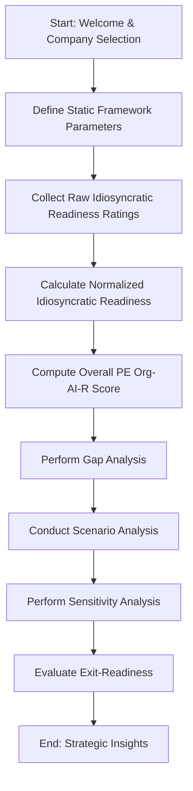

id: 69418ce8893d17251642968b_documentation
summary: PE-AI readiness simulator Documentation
feedback link: https://docs.google.com/forms/d/e/1FAIpQLSfWkOK-in_bMMoHSZfcIvAeO58PAH9wrDqcxnJABHaxiDqhSA/viewform?usp=sf_link
environments: Web
status: Published
# PE-AI Readiness Simulator: VentureBridge Capital

## 1. Welcome & Understanding the PE-AI Readiness Workflow
Duration: 0:05

Welcome to the **PE-AI Readiness Simulator: VentureBridge Capital** codelab! In this lab, you will step into the shoes of **Alex, a Quantitative Analyst at VentureBridge Capital**. Your primary objective is to evaluate **'InnovateCo'**, a hypothetical acquisition target in the Manufacturing sector, for its **AI readiness**.

<aside class="positive">
This application simulates a critical aspect of **private equity due diligence** in the age of AI. Understanding an acquisition target's AI maturity is paramount for identifying growth opportunities, mitigating risks, and ultimately, maximizing investment returns.
</aside>

This simulator guides you through VentureBridge Capital's proprietary, story-driven workflow to:

1.  **Assess InnovateCo's internal AI capabilities** (known as *Idiosyncratic Readiness*) across key organizational dimensions.
2.  **Quantify its overall AI maturity** using the proprietary `PE Org-AI-R Score`, which considers both internal strengths and external market opportunities.
3.  **Identify critical AI readiness gaps** by comparing InnovateCo against industry benchmarks, pinpointing strategic investment areas.
4.  **Model future AI readiness scenarios** and perform sensitivity analysis to identify high-impact improvement areas.
5.  **Evaluate InnovateCo's attractiveness to future buyers** from an AI perspective, yielding an `Exit-AI-R Score`.

Each step in this codelab mirrors a real-world task in private equity due diligence, enabling you to provide data-driven insights to inform multi-million dollar investment decisions.

### Core Concepts Explained:

*   **Idiosyncratic Readiness:** This refers to the internal, unique AI capabilities of a company. It's measured across dimensions like People, Process, Data, Technology, Strategy, and Culture. A strong idiosyncratic readiness indicates a company's internal capacity to adopt and leverage AI.
*   **PE Org-AI-R Score:** This is a comprehensive score that quantifies the overall AI maturity of an organization from a Private Equity perspective. It combines internal idiosyncratic readiness with external market factors, offering a holistic view of the target company's AI potential and current standing.
*   **Exit-AI-R Score:** This score evaluates how attractive a company would be to future buyers, specifically through the lens of its AI capabilities. It's crucial for private equity firms as it directly impacts the potential for a profitable exit.

### Overall Application Workflow

The application follows a sequential, logical flow mirroring a real-world analytical process. Below is a high-level overview of the workflow:

This structured approach ensures a thorough and consistent evaluation, providing actionable insights for investment decisions.

## 2. Define Static Framework Parameters
Duration: 0:03

The second step in our due diligence process involves setting up the foundational parameters that will influence our AI readiness assessment. These are "static" because they represent fundamental characteristics of InnovateCo and its market environment that are not expected to change rapidly.

### Purpose
Defining these parameters is crucial as they contextualize InnovateCo's AI readiness. For example, a company in an industry with high AI adoption potential will be evaluated differently than one in a low-potential industry.

### How to use this section
In the Streamlit application's sidebar, select **"2. Define Static Framework Parameters"**. You will be prompted to input or select the following:

*   **Target Company Name:** (e.g., InnovateCo)
*   **Target Company Industry Sector:** (e.g., Manufacturing, Finance, Healthcare)
*   **Industry AI Adoption Maturity:** A rating of how mature AI adoption is within InnovateCo's specific industry. This could be Low, Medium, or High.
*   **Market Attractiveness for AI Solutions:** How appealing the market is for AI solutions relevant to InnovateCo's business. This might also be rated as Low, Medium, or High.
*   **AI Integration Complexity:** The inherent difficulty of integrating AI solutions into InnovateCo's operations, considering its existing infrastructure and processes.

<aside class="negative">
Incorrectly defining these static parameters can significantly skew subsequent readiness scores and analyses. Always ensure these reflect the most accurate understanding of the target company and its operating environment.
</aside>

## 3. Collect Raw Idiosyncratic Readiness Ratings
Duration: 0:10

Now that our framework is set, we move to the core internal assessment: collecting raw ratings for InnovateCo's *Idiosyncratic Readiness*. This involves evaluating the company's internal capabilities across specific dimensions critical for AI adoption and success.

### Understanding Idiosyncratic Readiness Dimensions

Idiosyncratic readiness is broken down into several key dimensions, each representing a crucial aspect of an organization's ability to leverage AI:

*   **People:** Availability of skilled AI talent, leadership support, and employee AI literacy.
*   **Process:** AI-friendly workflows, data governance, and operational agility.
*   **Data:** Data quality, accessibility, volume, and relevance for AI applications.
*   **Technology:** Existing AI infrastructure, tools, and integration capabilities.
*   **Strategy:** Clear AI vision, alignment with business goals, and defined AI use cases.
*   **Culture:** Openness to innovation, experimentation, and data-driven decision-making.

### How to use this section
In the Streamlit application's sidebar, select **"3. Collect Raw Idiosyncratic Readiness Ratings"**.
You will be presented with input fields (e.g., sliders or dropdowns) for each of the idiosyncratic readiness dimensions. Your task as Alex is to provide an initial **raw rating** for InnovateCo for each dimension. These ratings are typically on a scale (e.g., 1-5 or 1-10), reflecting your expert judgment based on available information, interviews, and audits.

Consider the following when making your ratings:
*   **People:** Does InnovateCo have data scientists, ML engineers, and AI-savvy leadership?
*   **Process:** Are there established processes for data collection, annotation, and model deployment?
*   **Data:** Is InnovateCo's data clean, well-structured, and available for AI training?
*   **Technology:** What AI tools and platforms does InnovateCo currently use?
*   **Strategy:** Is there a clear AI roadmap that aligns with business objectives?
*   **Culture:** How willing are employees to adopt new AI-powered tools and methods?

## 4. Calculate Normalized Idiosyncratic Readiness
Duration: 0:05

After collecting the raw idiosyncratic readiness ratings, the next logical step is to process and normalize these scores. Normalization ensures that all dimensions are on a comparable scale, making aggregated analysis meaningful and preventing any single dimension from disproportionately influencing the overall score due to differing raw scales.

### Why Normalization?
Different assessment methodologies might use different scales (e.g., 1-5, 1-10, 0-100). Normalization converts these varied scales into a common range (typically 0-1 or 0-100), allowing for fair comparison and aggregation. It also helps to smooth out potential biases from raw scoring.

### How to use this section
In the Streamlit application's sidebar, select **"4. Calculate Normalized Idiosyncratic Readiness"**.
This page will automatically display the normalized scores based on the raw ratings you provided in the previous step. The application handles the mathematical transformation.

You will typically see:
*   A **table or list** showing the normalized score for each dimension (People, Process, Data, Technology, Strategy, Culture).
*   A **visual representation**, such as a radar chart (spider chart), which is excellent for visualizing multi-dimensional data. This chart will show InnovateCo's normalized strengths and weaknesses across all idiosyncratic readiness dimensions at a glance.

<aside class="positive">
A radar chart provides an intuitive way to identify InnovateCo's strongest and weakest AI readiness dimensions. A larger area covered by the polygon often indicates higher overall readiness, while specific spikes or dips highlight particular strengths or weaknesses.
</aside>

Mathematically, a common normalization technique is Min-Max scaling:
$$ X_{normalized} = \frac{X - X_{min}}{X_{max} - X_{min}} $$
Where $X$ is the raw score, $X_{min}$ and $X_{max}$ are the minimum and maximum possible scores for that dimension, respectively.

## 5. Compute the Overall PE Org-AI-R Score
Duration: 0:05

With the internal (idiosyncratic) readiness normalized, we can now calculate InnovateCo's comprehensive **PE Org-AI-R Score**. This is a crucial metric as it provides a single, aggregated value representing the company's overall AI maturity from a Private Equity investment perspective.

### What is the PE Org-AI-R Score?
The `PE Org-AI-R Score` is designed to provide a holistic view. It doesn't just look at internal capabilities but also incorporates external factors defined in Step 2. This ensures that the score reflects not only what the company *can do* with AI internally, but also its potential for AI success within its specific market context.

The score typically combines:
*   The **normalized idiosyncratic readiness** scores (internal capabilities).
*   The **static framework parameters** (industry AI adoption maturity, market attractiveness, AI integration complexity) which represent external opportunities and challenges.

### How to use this section
In the Streamlit application's sidebar, select **"5. Compute the Overall PE Org-AI-R Score"**.
This page will automatically calculate and display InnovateCo's `PE Org-AI-R Score`. You will usually see:

*   The **final calculated score**, often presented prominently.
*   A **breakdown** of how the score was derived, showing the contribution of internal readiness versus external market factors.
*   A **qualitative interpretation** of the score (e.g., "High Readiness," "Moderate Potential," "Needs Significant Investment").

While the exact formula is proprietary to VentureBridge Capital within this simulation, conceptually, it might look something like this:
$$ PE\_Org\_AI\_R = w_1 \times (\text{Avg Normalized Idiosyncratic Readiness}) + w_2 \times (\text{Industry AI Adoption}) + w_3 \times (\text{Market Attractiveness}) - w_4 \times (\text{AI Integration Complexity}) $$
Where $w_i$ are weightings reflecting the importance of each component.

<aside class="positive">
The `PE Org-AI-R Score` is a cornerstone metric for investment decisions. A higher score suggests InnovateCo is well-positioned to leverage AI for growth, while a lower score indicates potential risks or significant investment requirements for AI transformation.
</aside>

## 6. Perform Gap Analysis Against Industry Benchmarks
Duration: 0:08

Understanding InnovateCo's AI readiness in isolation is useful, but its true significance emerges when compared to industry peers. This step, **Gap Analysis**, allows you to benchmark InnovateCo's performance against typical industry standards, highlighting areas where it excels or lags.

### Purpose of Gap Analysis
Gap analysis helps to:
*   **Identify competitive advantages:** Where InnovateCo is ahead of its industry.
*   **Pinpoint critical weaknesses:** Areas where InnovateCo falls behind and requires strategic intervention.
*   **Inform strategic planning:** Provide data-driven justification for specific improvement initiatives.

### How to use this section
In the Streamlit application's sidebar, select **"6. Perform Gap Analysis Against Industry Benchmarks"**.
This page will present visualizations that compare InnovateCo's normalized idiosyncratic readiness scores (and potentially the overall PE Org-AI-R Score) against pre-defined industry benchmarks.

You can expect to see:
*   **Comparative Radar Charts:** Often, InnovateCo's radar chart will be overlaid with a benchmark radar chart, allowing for immediate visual comparison across all dimensions (People, Process, Data, Technology, Strategy, Culture).
*   **Bar Charts:** Individual bar charts comparing InnovateCo's score for each dimension against the industry average. These might show the "gap" numerically or graphically.
*   **Heatmaps or Tables:** Summarizing the differences and indicating whether InnovateCo is above or below the benchmark for each metric.

<aside class="negative">
A significant negative gap in critical dimensions like "Data" or "Technology" could indicate fundamental challenges for AI adoption, potentially requiring substantial capital expenditure or operational overhaul post-acquisition.
</aside>

As Alex, your role is to interpret these visualizations. For instance, if InnovateCo scores significantly lower in "Data" compared to the industry benchmark, it means InnovateCo might lack the robust data infrastructure or quality necessary to feed AI models effectively, signaling a priority area for post-acquisition investment.

## 7. Conduct Scenario Analysis for Strategic Planning
Duration: 0:12

Strategic planning in private equity often involves "what-if" scenarios to understand the impact of potential improvements or changes. **Scenario Analysis** allows you to model how InnovateCo's AI readiness would change if specific internal dimensions were improved.

### Purpose of Scenario Analysis
This step helps answer questions like:
*   "What if we invest heavily in AI talent (People dimension)?"
*   "How would improving data quality (Data dimension) impact the overall PE Org-AI-R Score?"
*   "Which improvements yield the most significant uplift in AI readiness?"

It's a powerful tool for developing post-acquisition value creation plans.

### How to use this section
In the Streamlit application's sidebar, select **"7. Conduct Scenario Analysis for Strategic Planning"**.
On this page, you will likely find interactive controls (e.g., sliders or input boxes) that allow you to **hypothetically adjust** the raw or normalized scores for specific idiosyncratic readiness dimensions.

Once you modify a dimension, the application will:
*   **Recalculate** the normalized idiosyncratic readiness scores.
*   **Recompute** the `PE Org-AI-R Score` based on your hypothetical improvements.
*   **Display updated visualizations** (e.g., radar charts, bar charts) showing the "before" and "after" state, or a comparison between different scenarios you've created.

You might be able to create multiple scenarios (e.g., "Aggressive Investment," "Moderate Improvement," "Best Case") and compare their outcomes side-by-side.

<aside class="positive">
Use scenario analysis to justify investment decisions. For example, if a 20% improvement in "People" leads to a 15% increase in the `PE Org-AI-R Score`, this provides strong quantitative support for investing in AI talent acquisition and training.
</aside>

This iterative process of adjusting inputs and observing outputs is key to developing robust strategic recommendations.

## 8. Perform Sensitivity Analysis of Key Dimensions
Duration: 0:10

Building on scenario analysis, **Sensitivity Analysis** takes a more systematic approach to identify which idiosyncratic readiness dimensions have the most significant impact on the overall `PE Org-AI-R Score`. Instead of manually trying "what-if" scenarios, this analysis quantifies the responsiveness of the output score to changes in individual input dimensions.

### Purpose of Sensitivity Analysis
Sensitivity analysis helps you:
*   **Prioritize improvement efforts:** Focus resources on dimensions that yield the greatest return on investment in terms of AI readiness.
*   **Understand risks:** Identify dimensions whose decline would most severely impact the overall score.
*   **Optimize resource allocation:** Ensure that strategic investments target the most impactful areas.

### How to use this section
In the Streamlit application's sidebar, select **"8. Perform Sensitivity Analysis of Key Dimensions"**.
This page will automatically perform calculations to determine the sensitivity of the `PE Org-AI-R Score` to changes in each of the idiosyncratic readiness dimensions (People, Process, Data, Technology, Strategy, Culture).

You can expect to see:
*   **Sensitivity Rankings:** A list or chart (e.g., a bar chart showing impact coefficients) indicating which dimensions, if improved by a certain percentage, would lead to the largest change in the `PE Org-AI-R Score`.
*   **Impact Visualizations:** Graphs showing how the `PE Org-AI-R Score` changes as a single dimension's rating is varied while others are held constant. This could be represented as slope, elasticity, or direct change in score.

For example, if a 1-point increase in "Data" score leads to a 0.5-point increase in the `PE Org-AI-R Score`, while a 1-point increase in "Culture" only leads to a 0.1-point increase, then "Data" is more sensitive and a higher priority for improvement.

<aside class="positive">
Sensitivity analysis provides a data-driven justification for resource allocation. It moves beyond intuition to show exactly where investments will have the greatest leverage in enhancing InnovateCo's AI readiness.
</aside>

This analysis is invaluable for crafting a prioritized action plan for InnovateCo post-acquisition.

## 9. Evaluate Exit-Readiness
Duration: 0:07

The final step in our analytical journey is to evaluate InnovateCo's **Exit-Readiness** from an AI perspective. For a private equity firm, the ultimate goal is a profitable exit. The `Exit-AI-R Score` assesses how attractive InnovateCo would be to future buyers, specifically considering its AI capabilities and potential.

### What is the Exit-AI-R Score?
The `Exit-AI-R Score` goes beyond InnovateCo's current operational efficiency or internal AI prowess. It considers factors that make a company appealing to a strategic buyer or a public market:
*   **Scalability of AI solutions:** Can InnovateCo's AI initiatives grow with the business?
*   **Defensibility of AI assets:** Are InnovateCo's AI models, data sets, or proprietary algorithms unique and difficult to replicate?
*   **Market perception of AI leadership:** Is InnovateCo seen as an innovator in its sector due to its AI capabilities?
*   **Future AI monetization potential:** Can InnovateCo's AI solutions generate new revenue streams or significantly reduce costs for a future owner?

### How to use this section
In the Streamlit application's sidebar, select **"9. Evaluate Exit-Readiness"**.
This page will calculate and display InnovateCo's `Exit-AI-R Score`. Similar to the `PE Org-AI-R Score`, this score will likely be a composite, integrating various factors from previous steps along with new considerations related to market appeal and strategic value.

You will typically see:
*   The **final `Exit-AI-R Score`**, often with a clear interpretation (e.g., "High Exit Potential," "Moderate Attractiveness").
*   A **breakdown of contributing factors**, which might include a weighted sum of the `PE Org-AI-R Score`, scalability metrics, defensibility indicators, and market potential.
*   **Recommendations or insights** on how to further enhance the `Exit-AI-R Score` during VentureBridge Capital's ownership period.

<aside class="positive">
A strong `Exit-AI-R Score` indicates that InnovateCo's AI capabilities not only drive current value but also present a compelling growth story for future acquirers, significantly enhancing its valuation upon exit.
</aside>

Understanding and actively managing towards a high `Exit-AI-R Score` is a key strategic imperative for any private equity investment. This concludes your simulated role as Alex, providing a comprehensive AI readiness assessment for InnovateCo!
